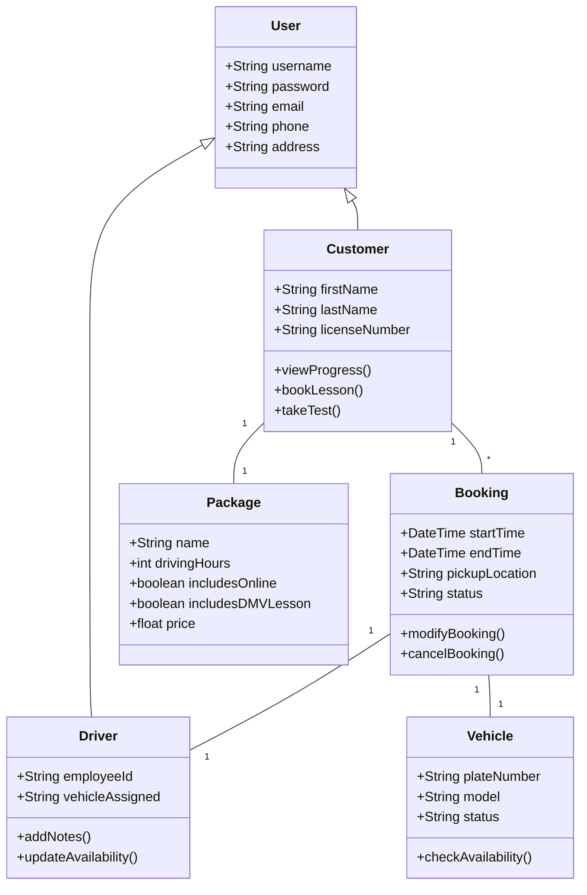

# UML Class Diagram

```mermaid
classDiagram
    class User {
        +String username
        +String password
        +String email
        +String phone
        +String address
    }
    
    class Customer {
        +String firstName
        +String lastName
        +String licenseNumber
        +viewProgress()
        +bookLesson()
        +takeTest()
    }
    
    class Driver {
        +String employeeId
        +String vehicleAssigned
        +addNotes()
        +updateAvailability()
    }
    
    class Booking {
        +DateTime startTime
        +DateTime endTime
        +String pickupLocation
        +String status
        +modifyBooking()
        +cancelBooking()
    }
    
    class Package {
        +String name
        +int drivingHours
        +boolean includesOnline
        +boolean includesDMVLesson
        +float price
    }
    
    class Vehicle {
        +String plateNumber
        +String model
        +String status
        +checkAvailability()
    }
    
    User <|-- Customer
    User <|-- Driver
    Customer "1" -- "*" Booking
    Customer "1" -- "1" Package
    Booking "1" -- "1" Driver
    Booking "1" -- "1" Vehicle
```