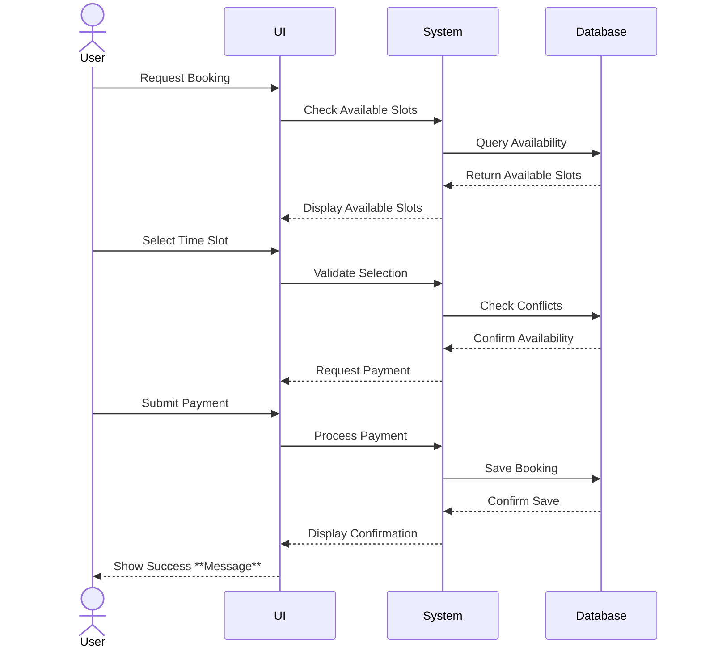

# UML Sequence Diagram

```mermaid
sequenceDiagram
    actor User
    participant UI
    participant System
    participant Database
    
    User->>UI: Request Booking
    UI->>System: Check Available Slots
    System->>Database: Query Availability
    Database-->>System: Return Available Slots
    System-->>UI: Display Available Slots
    User->>UI: Select Time Slot
    UI->>System: Validate Selection
    System->>Database: Check Conflicts
    Database-->>System: Confirm Availability
    System-->>UI: Request Payment
    User->>UI: Submit Payment
    UI->>System: Process Payment
    System->>Database: Save Booking
    Database-->>System: Confirm Save
    System-->>UI: Display Confirmation
    UI-->>User: Show Success **Message**
```